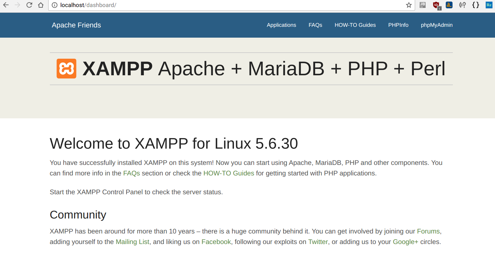
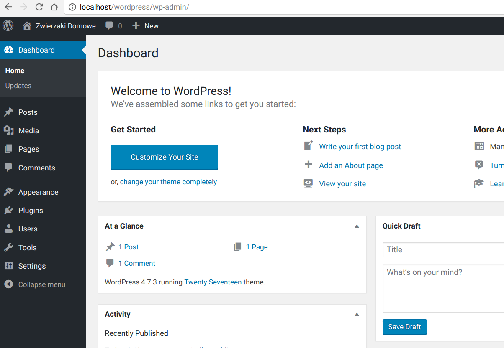

## Project configuration (setup tutorial)

Do following to start working on latest SuperAnkietator version.

1. Install **XAMPP** from [link](https://www.apachefriends.org/index.html)

>> Note: We need **XAMPP MySQL** and **phpMyAdmin** so if you are on windows be sure they are checked.
2. Download **Wordpress** from [link](https://wordpress.org/latest.zip)

>> Note: XAMPP root directory is probably named`\xampp\` on windows, `/lampp/` on linux.
3. Extract wordpress to `[xampp_root_dir]/htdocs/` so that directory structure looks like `[xampp_root_dir]/htdocs/wordpress/[wordpress_files]`
4. Go into `/htdocs/wordpress` directory
5. Do following git commands:

        git init
        git remote add origin https://github.com/siulkilulki/TSI-SuperAnkietator.git
        git fetch --all
        git reset --hard origin/master
        git branch -u origin/master
6. Copy `wp-config.php` attached to email message into `[xampp_root_dir]/htdocs/wordpress/` directory
7. Run xampp.
    On linux it's following command from <xampp_root_dir>:
        `sudo ./xampp start` to stop run `sudo ./xampp stop`
    On windows you have two options:
    * run `\xampp\xampp-control.exe` and then use *xampp-control* interface
    or
    * run `\xampp\xampp_start.exe` (to stop run `\xampp\xampp_stop.exe`)
8. If xampp is correctly installed you should be able to see following screen at adress [http://localhost/dashboard/](http://localhost/dashboard/)

9. In your browser, go to [http://localhost/wordpress/](http://localhost/wordpress/). If you see following website, you are good to go.

